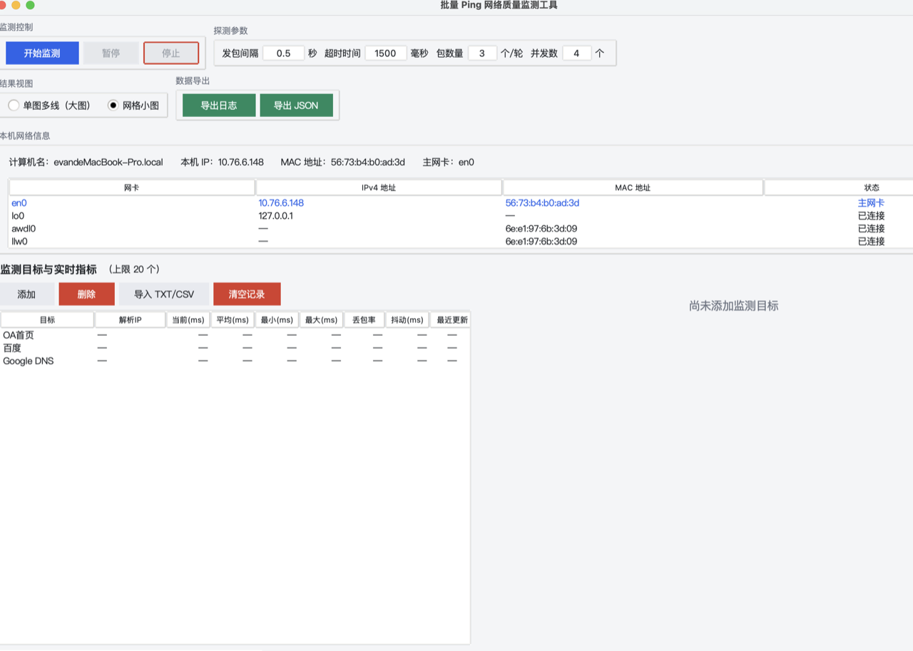

# PingMonitor · 批量 Ping 网络质量监测工具

面向网络管理员的批量 Ping 探测与实时质量监测桌面工具。零第三方运行时依赖，双击即运行。

## 平台下载 / Downloads

| 平台 | 文件 | 说明 |
|------|------|------|
| **Windows** | [PingMonitor.exe](https://github.com/EvanHo-git/PingMonitor-src/releases/tag/NetworkTools) | 由 GitHub Actions 自动构建（`windows-latest` + PyInstaller），双击运行，无需安装 Python。 |
| **macOS**   | [PingMonitor-macOS.zip](https://github.com/EvanHo-git/PingMonitor-src/releases/tag/macOS-v1.0.0) | 本地 PyInstaller 打包（macOS 13+），解压双击 `PingMonitor.app` 运行，无需安装 Python。 |

> Windows 构建由本仓库 `.github/workflows/build.yml` 在 `windows-latest` 上自动构建并发布；macOS 构建在本地打包后通过 GitHub Web UI 上传。

## 核心功能 / Features

- **批量并发 Ping**：自定义发包间隔 / 超时 / 包数 / 并发数，对多个目标并行探测。
- **实时趋势图**：单图多线（大图）与网格小图两种模式，可视化各目标时延波动。
- **持续记录与导出**：滚动保留最近 N 点 / 目标，支持导出 CSV / JSON 日志便于后续分析。
- **本机网络信息**：自动展示本机 IP / MAC / 网卡列表与连接状态。
- **本轮 6 项产品优化**（本次发布）：
  - 新目标**插入列表顶部**并自上而下展示
  - 右键菜单**修改目标**（复用添加对话框）
  - 删除目标前弹**确认对话框**
  - 首次打开**预设默认目标**（www.baidu.com / 8.8.8.8）
  - 监测进行中**热添加**：新增目标立即纳入后续轮次
  - 修复添加目标弹窗**确认按钮空白**（macOS Aqua 下改用 ttk 语义样式）

## 从源码构建 / Build from Source

- 依赖：Python 3.13（标准库 tkinter）
- Windows：`python build/build_windows.py`（或 CI 自动构建）
- macOS：`bash build/build_macos.sh`
- 自检：`python -m src.main --selftest`

## 自检 / Self-test

`--selftest` 覆盖：解析 35 项 / 命令构造 / 真实回环 0% 丢包 / 三平台 hostinfo + 21 网卡 / Tcl-Tk 版本。GUI 集成测试 68/68 PASS。